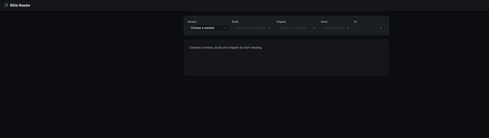
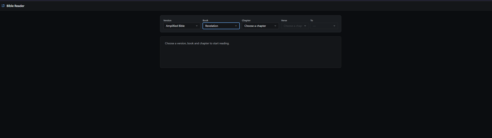
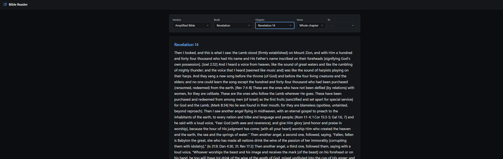
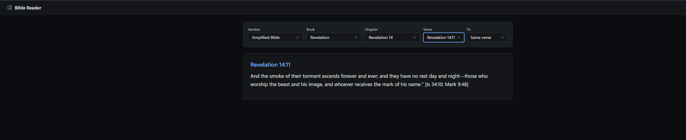
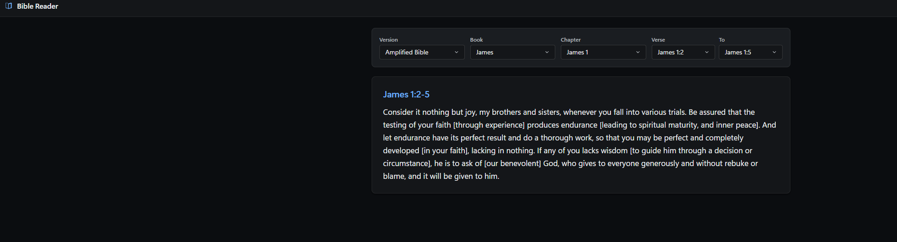

# Bible Reader

A full-stack Bible reading application: an Angular client for browsing Bible versions, books,
chapters, and verses, backed by an ASP.NET Core API that wraps the
[YouVersion Bible Platform](https://developers.youversion.com/) API.

The backend is built around **[BiblePlatformDotNetSDK](https://github.com/kevinRForshey/BiblePlatformDotNetSDK)**,
a .NET SDK for the YouVersion Bible Platform API. This project consumes a version of that SDK
compiled into NuGet packages (`BiblePlatform.API`, `BiblePlatform.API.Models`,
`BiblePlatform.SDK.Services`, `BiblePlatform.UsfmReferences`) rather than a project reference, and
the ASP.NET Core endpoints in `AngularBibleReader.Server` are built directly around the services
that SDK exposes (version/book/chapter/verse lookups, passage retrieval, OAuth + PKCE sign-in, and
highlights).

## Features

- Browse available Bible versions, then drill into books, chapters, and verses
- Read a passage as whole chapter, a single verse, or a verse range (pick a start verse and an end
  verse; the app builds the `BOOK.CHAPTER.START-END` USFM reference for you)
- Fluent 2-styled UI with automatic light/dark theming based on the OS setting
- Local account registration and sign-in (`/register`, `/login`) built to practice Angular
  **Reactive Forms** — a `SQLite` database via EF Core on the backend, with client-side and
  server-side validation, session-based sign-in, and a signed-in state shown in the app bar

The backend also exposes OAuth 2.0 + PKCE sign-in and a highlights API (`AuthController`,
`HighlightsController`) via the SDK's `IBibleOAuthClient` and `IHighlightService` — these endpoints
are implemented and working, but the Angular client does not yet have UI for sign-in or highlights.
This is separate from the local registration/login feature above, which uses its own session
namespace and doesn't touch the Bible Platform OAuth flow.

## Screenshots

| | |
|---|---|
|  Starting state — nothing selected yet |  Choosing a book, with the chapter and verse selectors enabling as each prior choice is made |
|  Reading a whole chapter (Revelation 14, Amplified Bible) |  Narrowing down to a single verse (Revelation 14:11) |


Picking a start and end verse reads as a range (James 1:2-5)

## Scope

At its core this is a straightforward CRUD-style drill-down (version → book → chapter → verse →
passage), with no state management library — a couple of injectable services with Angular signals
cover the shared UI state. The local registration/login feature was added on top as a small,
self-contained excuse to practice Angular Reactive Forms and client-side routing (`app.routes.ts`
now has real routes) against a real backend and database, rather than as a fully fledged auth
system — the Bible reader itself stays open to everyone; signing in doesn't gate anything.

This is a simple weekend project I spent a couple of days on to freshen up my Angular familiarity.
It has a full component/service test suite on the client (Vitest, enforced at a 90% coverage floor)
and an NUnit suite on the server covering the account/data layer — see [Testing](#testing).

## Project structure

```
AngularBibleReader.slnx           Solution file (open this in Visual Studio)
nuget.config / packages/          Local NuGet feed for the Bible SDK packages (see below)
AngularBibleReader.Server/        ASP.NET Core Web API (.NET 10)
  Controllers/                    Versions, Books, Chapters, Verses, Passage, Usfm, Auth,
                                   Highlights, Account (local register/login)
  Data/                           AppDbContext (SQLite), UserRepository, EF Core migrations
  Extensions/                     DI registration for the Bible SDK services
  Auth/SessionTokenProvider.cs    Per-session OAuth token storage (multi-user web backend)
  App_Data/                       SQLite database file lives here (gitignored, auto-created)
AngularBibleReader.Server.Tests/  NUnit tests for the account/data layer
angularbiblereader.client/        Angular 22 client (standalone components, signals)
  src/app/components/             version-selector, book-selector, chapter-selector, verse-selector,
                                   bible-text, bible-reader, register-form, login-form
  src/app/core/                   BibleApiService, BibleSelectionService, AuthService
```

### Why there's a `packages/` folder with `.nupkg` files checked in

`BiblePlatformDotNetSDK` isn't published to nuget.org — it's only compiled locally into `.nupkg`
packages. `packages/` is a local NuGet feed containing those packages, and `nuget.config` points
restore at it (alongside nuget.org for everything else). Committing the packages is a pragmatic
stand-in for a private/internal NuGet feed so `dotnet restore` works out of the box without extra
setup; the tradeoff is `.git` carrying binary package files instead of just source.

## Prerequisites

- [.NET 10 SDK](https://dotnet.microsoft.com/download)
- [Node.js](https://nodejs.org/) (with npm)
- A YouVersion Bible Platform **App Key**. Request one from the
  [YouVersion Developer Portal](https://developers.youversion.com/).

## Configuration: YouVersion API key

The backend needs a YouVersion Platform App Key before it will start. **The API key and the OAuth
client ID are the same value** — YouVersion issues a single App Key that serves both purposes, so
you set the same key under two different configuration paths.

Do **not** put the key in `appsettings.json` (it's committed to source control). Use
[.NET User Secrets](https://learn.microsoft.com/aspnet/core/security/app-secrets) instead, from the
`AngularBibleReader.Server` directory:

```bash
cd AngularBibleReader.Server
dotnet user-secrets init
dotnet user-secrets set "BibleApi:AppKey" "<your-youversion-app-key>"
dotnet user-secrets set "BibleOAuth:ClientId" "<your-youversion-app-key>"
```

| Secret key | Purpose |
|---|---|
| `BibleApi:AppKey` | Authenticates direct calls to the Bible Platform REST API (versions, books, chapters, verses, passages) |
| `BibleOAuth:ClientId` | Identifies this app during the OAuth 2.0 + PKCE sign-in flow |

Both keys must be set to your YouVersion App Key value. `dotnet user-secrets` writes to a JSON file
outside the repo (`%APPDATA%\Microsoft\UserSecrets\<id>\secrets.json` on Windows,
`~/.microsoft/usersecrets/<id>/secrets.json` on macOS/Linux) and is only loaded when
`ASPNETCORE_ENVIRONMENT=Development`, which is the default when running from Visual Studio or
`dotnet run` without overriding it.

Other `BibleOAuth` settings (`RedirectUri`, `Scopes`) already have working defaults in
`appsettings.json` for local development and don't need to be secrets.

## Running the app

### Visual Studio

1. Open `AngularBibleReader.slnx`.
2. Make sure `AngularBibleReader.Server` is the startup project.
3. Press F5.

The server project references `Microsoft.AspNetCore.SpaProxy`, which automatically runs
`npm start` for the Angular client and proxies requests to it — you don't need to start the
Angular dev server yourself.

### Command line

Run the API and the Angular dev server in two terminals:

```bash
# Terminal 1: backend
cd AngularBibleReader.Server
dotnet run

# Terminal 2: frontend
cd angularbiblereader.client
npm install
npm start
```

`npm start` runs `ng serve` with HTTPS and proxies `/api` requests to the backend (see
`angularbiblereader.client/src/proxy.conf.js`).

## Testing

```bash
# Backend — build + NUnit tests (AngularBibleReader.Server.Tests)
dotnet build AngularBibleReader.slnx
dotnet test AngularBibleReader.Server.Tests/AngularBibleReader.Server.Tests.csproj

# Frontend — Vitest, watch mode by default
cd angularbiblereader.client
npm test

# Frontend — single run with a coverage report
npm run test:coverage
```

`npm run test:coverage` enforces a 90% minimum on statements, branches, functions, and lines
(configured as `coverageThresholds` on the `test` target in `angular.json`) — the command exits
non-zero if coverage drops below that on any metric.

## Tech stack

| Layer | Technology |
|---|---|
| Client | Angular 22, TypeScript, RxJS, Reactive Forms, Vitest |
| Server | ASP.NET Core (.NET 10), EF Core + SQLite (local accounts), NUnit |
| Bible data | [BiblePlatformDotNetSDK](https://github.com/kevinRForshey/BiblePlatformDotNetSDK) NuGet packages, wrapping the YouVersion Bible Platform API |
